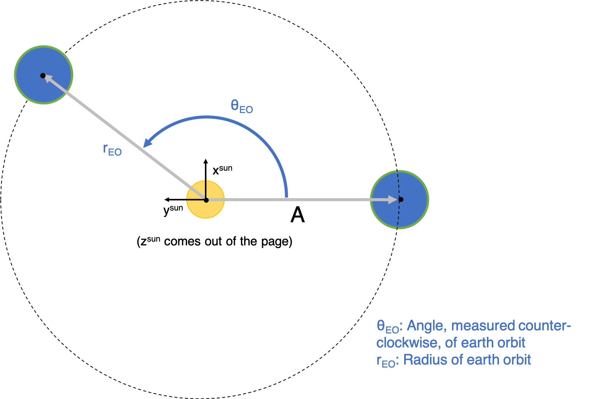

# sun_coordinates
Get the spherical coordinates of the sun in the sky from any location on earth at any time

## Quick Summary
The sun.py script can take in any location in the world, and any time, and output the spherical coordinates of the sun from the perpective of a person standing on the earth's surface at that location. This is done using vector addition and coordinate transformations (elaborated on later).

The location of the sun is given by two angles:
* Theta_from_North - angle measured clockwise from due north to the point on the horizon underneath the sun
* Phi_from_Horizon: - angle from the horizon up to the sun

A 3D visualization using Matplotlib of the sun's location in the sky is also outputted by the model:


## How to run the code

First, setup environment and install dependencies by running:

```
conda create --name sun --file requirements.txt
```
Now, you should be able to run the code. It takes three inputs: time, location, and save figure boolean. These inputs can be given in the command line, or by modifying the get_inputs(args) method within the script directly.

Command Line Instructions:
* -d: Date and time string of form 'YYYY-MM-DD HH:MM:SS'
* -c: String containing the city. This input is relatively versatile since multiple city structures are accepted (for example: San Francisco or San Francisco, CA). If your city is two words, or you're including state/country, make sure to use quotes ''.
* -p: Write a save file name + extension to save an image of the 3D visualization locally

Example Command Line Input:

```
python sun.py -d '2020-09-07 13:54:00' -c 'San Francisco' -p out.png
```
Default inputs:
* If no inputs are provided, the model will output the sun's location in San Francisco, CA at the current time it is in SF.
* If just the city is provided, the model will output the sun's location in that city at that city's current time.
* If just a date and time are provided, the model will output the sun's location in SF at the date and time provided.

The National Oceanic and Atmospheric Administration has a website that will provide the precise location of the sun (https://www.esrl.noaa.gov/gmd/grad/solcalc/). See how my values compare!

## Physics behind model

The key calculation is getting the vector that points from the person on the surface of the earth to the sun (Vector C in the figure below). 


This can be calculated simply by adding two vectors: a vector pointing from the center of the sun to the center of the earth (Vector A) and a vector pointing from the center of the earth to the surface of the earth (Vector B).

_**A**_ + _**B**_ = -_**C**_ 

The tricky part of this math is the reference frame (ie coordinate system) of the vectors. Ultimately, we want vector C in the reference frame of a person standing on the surface of the earth. In other words, the origin should be at the person's feet, with x pointing east, y pointing north, and z pointing straight up. The reason we want this is that Theta_from_North and Phi_from_Horizon pop out super easily from those x, y, and z coordinates. Unfortunately, representing vectors _**A**_ and _**B**_ in the earth's surface coordinate system is difficult. However, _**A**_ and _**B**_ can be represented easily in different coordinate systems: _**A**_ can be represented easily in a coordinate system with the origin at the sun, and _**B**_ can be represented easily with an origin at the center of the earth.

To reconcile this challenge, the key is to use coordinate transformations! The basic idea here is that we start in the coordinate system that's easiest to intuitively write the vector we want, then we transform it to the coordinate system of the vector we want to add it to. Our specific workflow is broken down as follows:

1. Write vector _**A**_<sup>sun</sup>, which goes from the center of the sun to the center of the earth, in the sun's coordinate system (origin at center of the sun).
2. Transform _**A**_<sup>sun</sup> to _**A**_<sup>earth</sup> so that it's in the coordinate system of the earth (origin is at the center of the earth)
3. Write vector _**B**_<sup>earth</sup>, which goes from the center of the earth to the earth's surface, in earth's coordinate system.
4. Add _**A**_<sup>earth</sup> and _**B**_<sup>earth</sup> to get _**C**_<sup>earth</sup>, which is the vector we ultimately want, but is currently in the wrong coordinate system.
5. Transform _**C**_<sup>earth</sup> to _**C**_<sup>surf</sup> so that it's in the coordinate system of the earth's surface (origin centered at a person's feet on the surface)
6. Calculate Theta_from_North and Phi_from_Horizon from _**C**_<sup>surf</sup>
7. Write dependent variables in terms of model inputs: time and location.

Useful guide about coordinate transformations can be found here:
https://ocw.mit.edu/courses/aeronautics-and-astronautics/16-07-dynamics-fall-2009/lecture-notes/MIT16_07F09_Lec03.pdf

### Step 1. Write _**A**_<sup>sun</sup> in the sun's coordinate system



From the above figure, it's pretty straightforward to see that vector _**A**_<sup>sun</sup>, in the coordinate system of the sun (superscript s), can be written as:


### Step 2. Transforming _**A**_<sup>sun</sup> to _**A**_<sup>earth</sup> so that it's in earth's coodinate system

We now have to transform _**A**_<sup>sun</sup> to _**A**_<sup>earth</sup> (coordinate system of the earth). Fun fact: If it were not for the fact that the earth rotated around a tilted axis, the earth and the sun would share the same coordinate system! This difference is the key to coming up with the basis vectors for the earth's coordinate system. The figure below will help illustrate visually how the sun's basis vectors and the earth's basis vectors differ.


From the figure, we see that y and z are shifted by the tilt of the earth. Luckily, we can define the new coordinate system where the tilt only occurs in the yz plane such that x is preserved! The basis vectors for earth's coordinate system are as follows:


To transform _**A**_<sup>sun</sup>, we use the following formulas, which can be found in the MIT lecture notes I linked above.


After wading through the tedious algebra, we get the following for _**A**_<sup>earth</sup>:


### Step 3. Write _**B**_<sup>earth</sup> in the earth's coordinate system

_**B**_<sup>earth</sup> is the vector that goes from the center of the earth to the earth's surface at the location we're interested in. Any location on the surface of the earth can be represented by two angles, &theta;<sub>LL</sub> and &phi;<sub>LL</sub> (LL since these quantities act kind of like longitude and latitude), as shown in the figure below. 


From the above figure, and using the definition of spherical coordinates, _**B**_<sup>earth</sup> can be derived as:


### Step 4. Add _**A**_<sup>earth</sup> and _**B**_<sup>earth</sup> to get _**C**_<sup>earth</sup>

To get _**C**_<sup>earth</sup>, we need to add _**A**_<sup>earth</sup> and _**B**_<sup>earth</sup> and then flip the direction so that _**C**_<sup>earth</sup> is pointing towards the sun:


### Step 5. Transform _**C**_<sup>earth</sup> to _**C**_<sup>surf</sup> so that it's in the coordinate system of the earth's surface

To transform _**C**_<sup>earth</sup> to _**C**_<sup>surf</sup> we need the basis of the earth's surface coordinate system. Deriving this basis was the most challenging part of the model by far, but let me provide some intuition that will hopefully make it understandable. For this basis, I visualized myself standing on the earth's surface and realized that the cardinal direction are in some ways at least part of a basis. So rather than using x, y, z for this basis, I used North (_**n**_<sup>surf</sup>), East (_**e**_<sup>surf</sup>), and Perpendicular (_**p**_<sup>surf</sup>). If you're on the surface of earth, _**n**_<sup>surf</sup> is the tangential vector always pointing towards the north pole. _**e**_<sup>surf</sup> is the tangential vector always pointing due east. _**p**_<sup>surf</sup> is the vector normal to the surface. As these are all orthogonal to each other, they have to form a basis.


The challenge is representing these basis vectors in the earth's coordinate system. After lots and lots and lots of visualization and trial and error, I was able to come up with the equations below. I'd recommend looking at the figures and potentially playing around with a ball and stick model to verify for yourself that it's correct. The locations where _**p**_<sup>surf</sup>, _**n**_<sup>surf</sup>, or _**e**_<sup>surf</sup> line up with _**x**_<sup>earth</sup>, _**y**_<sup>earth</sup>, or _**z**_<sup>earth</sup> are good edge cases to use to gain intuition.


Now that we have the basis vector for the earth's surface coordinate system, we can plug them in to the same coordinate transform formula we used earlier and, after even more tedious math, we get out _**C**_<sup>surf</sup>!


### Step 6. Calculate Theta_from_North and Phi_from_Horizon from _**C**_<sup>surf</sup>

Now that we have the vector that points to the sun from the earth's surface (and it's in the right coordinate system!), we can easily calculate Theta_from_North and Phi_from_Horizon, the two main outputs given by the model, using basic spherical coordinate definitions. We do this last step since theta and phi are much easier to use to find the sun compared to using the relative magnitudes of xyz vectors to figure out where the sun is.

  

### Step 7. Write dependent variables in terms of model inputs: time and location.

While _**C**_<sup>surf</sup> is the only vector we need to calculate Theta_from_North and Phi_from_Horizon, its dependent variables are &theta;<sub>LL</sub>, &phi;<sub>LL</sub>, are &theta;<sub>EO</sub> (&phi;<sub>E</sub> is a constant), which we don't actually input to the model. What we do input are a date, time, and longitude and latitude. 

&theta;<sub>LL</sub> and &phi;<sub>LL</sub> are akin to longitude and latitude, but there are a few key differences. The "longitude" (&theta;<sub>LL</sub>) also depends on the rotation of the earth (ie what time it is!). The "latitude" is defined to have a different zero point. I defined &phi;<sub>LL</sub> to be zero at the poles, but latitude is zero at the equator. &theta;<sub>EO</sub> is the angular position of the earth in its orbit around the sun. This also depends on the date and time!

Taking these corrections into account, we get the following formulas for &theta;<sub>LL</sub>, &phi;<sub>LL</sub>, and &theta;<sub>EO</sub>:


LO is longitude and LA is latitude, both in decimal degress. &Delta;t is the amount of time between the time inputted in the model, and an initial condition time. In this model, I chose March 20, 2020 at noon, which is the spring equinox, as the initial condition. At LO, LA = 0 and &Delta;t = 0, which is the equivalent of being at the intersection of the equator and prime meridian right when the spring equinox is happening, the sun should be really close to being direclty overhead. Plug in these values to our equations and that's what you'll get (technically Theta_from_North is undefined, but that's because the sun is direclty overhead!).

t<sub>year</sub> is the amount of time in a year, and t<sub>SRday</sub> is the amount of time in a sidereal day. A sidereal day is the amount of time it takes the earth to rotate exaclty 360 degress, which is a little less than 24 hours. The reason it takes 24 hours for the sun to return to the same spot in the sky is because the earth has moved in it's orbit ever so slightly such that the earth has to overrotate just that little bit. Check out this well written wiki article to learn more: https://en.wikipedia.org/wiki/Sidereal_time#:~:text=Briefly%2C%20sidereal%20time%20is%20a,at%20the%20same%20sidereal%20time.

## Concluding Remarks

There you have it! A detailed explanation behind how I created this model that can give the location of the sun in the sky at any time and location. As you've probably already guessed, this model isn't entirely accurate because a lot of assumptions are intrinsically present in the math, such as assuming perfectly circular orbits. It turns out that there are a lot of weird idiosyncrasies in orbital mechanics that were too complex for this first version of this model. Despite that, my random testing of the model showed that the outputted angles were usually accurate to within 10 degrees, which I think is not bad at all for an analytical model such as this.

Hope you enjoy using this model as much as I enjoyed making it! Thanks! 


